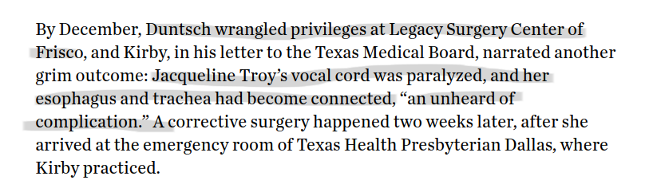

class: clear

<!-- Adjust some CSS code for font size, maintain R code font size -->
<style type="text/css">
.remark-slide-content {
    font-size: 30px;
    padding: 1em 2em 1em 2em;    
}
.remark-code, .remark-inline-code { 
    font-size: 20px;
}
</style>


<!-- Set R options for how code chunks are displayed and load packages -->
```{r setup, include=FALSE}
options(htmltools.dir.version = FALSE)
options(dplyr.summarise.inform = FALSE)
library(knitr)
opts_chunk$set(
  fig.align="center",  
  fig.height=3, #fig.width=6,
  # out.width="748px", #out.length="520.75px",
  dpi=300, #fig.path='Figs/',
  cache=T#, echo=F, warning=F, message=F
  )

knitr::opts_hooks$set(fig.callout = function(options) {
  if(options$fig.callout) {
    options$echo = FALSE
  }
  options
})

if (!require("pacman")) install.packages("pacman")
pacman::p_load(tidyverse, ggplot2, dplyr, lubridate, readr, readxl, hrbrthemes,scales, gganimate, gapminder, gifski, png, tufte, plotly, OECD, ggrepel, xaringanExtra, webshot, widgetframe)

```


```{r xaringan-scribble, echo=FALSE}
xaringanExtra::use_scribble(rgb(0.9, 0.5, 0.5))
```


.center[
```{r echo=FALSE, out.height="600px", out.width="800px"}
knitr::include_graphics('images/dr-death-cover.png')
```
]


---
class: clear

.center[
```{r echo=FALSE, out.height="600px", out.width="800px"}
knitr::include_graphics('images/mugshots.png')
```
]

---
# Baylor Plano, 2011, Lee Passmore

.center[
```{r echo=FALSE, out.height="50%", out.width="50%"}
knitr::include_graphics('images/passmore-highlight.png')
```
]

---
# Baylor Plano, 2012, Barry Morguloff

.center[
```{r echo=FALSE, out.height="75%", out.width="75%"}
knitr::include_graphics('images/morguloff-highlight.png')
```

]


---
# Baylor Plano, 2012, Jerry Summers

.center[
```{r echo=FALSE, out.height="75%", out.width="75%"}
knitr::include_graphics('images/summers-highlight.png')
```
]


---
# Baylor Plano, 2012, Kellie Martin

.center[
```{r echo=FALSE, out.height="75%", out.width="75%"}
knitr::include_graphics('images/martin1-highlight.png')
```
]


---
# Dallas Medical Center, 2012, Floella Brown

.center[
```{r echo=FALSE, out.height="75%", out.width="75%"}
knitr::include_graphics('images/brown-highlight.png')
```
]


---
# Dallas Medical Center, 2012, Mary Efurd

.center[
```{r echo=FALSE, out.height="75%", out.width="75%"}
knitr::include_graphics('images/efurd-highlight.png')
```

]


---
# South Hampton Medical, 2012, Jeff Cheney

.center[
```{r echo=FALSE, out.height="75%", out.width="75%"}
knitr::include_graphics('images/cheney-highlight.png')
```

]


---
# Legacy Surgery Center at Frisco, 2012, Marshall Muse

.center[
```{r echo=FALSE, out.height="75%", out.width="75%"}

```

]

---
# Legacy Surgery Center at Frisco, 2012, Jacqueline Troy

.center[
```{r echo=FALSE, out.height="75%", out.width="75%"}

```

]


---
# Legacy Surgery Center at Frisco, 2013, Philip Mayfield

.center[
```{r echo=FALSE, out.height="75%", out.width="75%"}

```

]


---
# University General at Dallas, 2013, Jeff Glidewell

.center[
```{r echo=FALSE, out.height="75%", out.width="75%"}
knitr::include_graphics('images/glidewell-highlight.png')
```

]

---
# Question

- **Motivating question:** How did Dr. Death keep getting patients?
- **Research question:** Do PCPs learn about specialist quality and adjust referral patterns accordingly?


---
# Contribution

1. Policy and "variation":

  - Significant focus on changing physician treatment decisions
  - We consider changing who does the procedure rather than how it's done

2. Referrals and learning:

  - Consider and estimate physician learning directly
  - Much more complete data


---
# Policy and "variation"


.pull-left[
 
**Potential lives saved: 30 per year**
]

.pull-right[
 
**Potential events saved: 550 per year**
]


---
# Referrals and learning

- Almost no work on physician learning in referrals
- **Johnson (2011) "Ability, Learning, and the Career Path of Cardiac Specialists."**
--

  - Frequency of exits or practice movements as function of negative outcomes
  - Low quality surgeons more likely to exit market or move practice
  - Data for specialists only, assumed to reflect learning after ruling out other mechanisms


---
# Referrals and learning

- Almost no work on physician learning in referrals
- Johnson (2011) "Ability, Learning, and the Career Path of Cardiac Specialists."
- **Sarsons (2017), "Interpreting Signals in the Labor Market: Evidence from Medical Referrals"**
--

  - Considers learning framework as motivation
  - Estimates relationship between negative outcomes and quarterly referrals among PCP/specialist pairs
  - PCPs interpret negative outcomes differentially by gender


---
class: inverse, center, middle
name: model

# Learning Framework

<html><div style='float:left'></div><hr color='#EB811B' size=1px width=1055px></html>


---
# Setup

- PCP $i$ sends a patient to specialist $j$ at time $t$, $D_{ijt} \in 0,1$
- Outcome is binary $Y_{ijt} \in 0,1$, with 1 being success (e.g., no complication or readmission)
- Probability of success for specialist $j$: $p_j \equiv \Pr(Y_{ijt} = 1)$, assumed constant over time and across patients

--

PCPs do not know $p_j$ but use Bayesian inference to learn about it from their patients' outcomes


---
# Beliefs

- Beliefs about $p_j$ follow a beta distribution, with parameters:

  - $(a_0, b_0)$ in the initial period (common prior beliefs) 
  - $(a_{ijt}, b_{ijt})$ in period $t$
  
--

- Beliefs updated based on the numbers of successes and failures experienced with specialist $j$, as follows:
$$a_{ijt} = a_0 + \sum_{s=1}^t Y_{ijs}$$ 
$$b_{ijt} = b_0 + \sum_{s=1}^t (D_{ijs} - Y_{ijs})$$


---
# Beliefs

Mean and variance of the beliefs about $p_j$ in period $t$:
$$m_{ijt} \equiv \frac{ a_{ij,t-1} }{ a_{ij,t-1} + b_{ij,t-1} }$$
$$v_{ijt} \equiv \frac{ a_{ij,t-1} b_{ij,t-1} }{ (a_{ij,t-1} + b_{ij,t-1})^2 (a_{ij,t-1} + b_{ij,t-1} + 1) }$$


---
# Patient Utility

- PCPs perfect agents of patients
- Patient (and PCP) utility: $U_{ijt} = \alpha Y_{ijt} + \epsilon_{ijt}$
- PCP chooses specialist with highest expected utility

$$\max_j \text{E} \left[ U_{ijt} | a_{ij,t-1}, b_{ij,t-1} \right] = \max_j \left\{ \alpha \text{E} \left[ Y_{ijt} | a_{ij,t-1}, b_{ij,t-1} \right]+ \epsilon_{ijt} \right\}$$

---
class: inverse, center, middle
name: data

# Data and Restrictions

<html><div style='float:left'></div><hr color='#EB811B' size=1px width=1055px></html>


---
# Data Sources

- 100% Medicare claims data (Inpatient, Outpatient, Carrier Claims) from 2008 through 2018
- MD-PPAS (physician information)
- AHA Annual Surveys (hospital characteristics)
- American Community Survey (market level demographics)


---
# Sample Construction

- Planned and elective inpatient stays
- Age 65 or above
- Major joint surgery
  - DRG 470 (major joint replacement, lower, w/o cc): 87%
  - DRG 483 (major joint replacement, upper, with cc): 5%
  - DRG 469 (major joint replacement, lower, with cc): 3%
  - DRG 462 (multiple joint procedures, lower, w/o cc): 2%

  
---
# What is a referral?

- Assign a PCP to each surgery based on:

  1. Referring physician listed "in the data"
  2. Most frequently visited physician in last year
    - Tiebreaker to most recently visited
  
--

- Specialist is operating physician listed on the claim, limited to orthopedic surgeons

---
# What is the referring "physician"?

- PCP is "primary care" as per MD-PPAS
- Limit to established or will-be-established practices
  - At least 3 consecutive years having non-zero referrals
  - At least 20 patients total across all years


---
# What is a failure?

Any of the following:

- 90-day mortality
- 90-day readmission
- 90-day complication (SSI or sepsis)


---
# A note on information...

For now:

- Information flows to a single PCP
- PCP "sees" all failure events for their own patients and is unaware of failures from other patients
- Failures/successes only inform about quality of specialist $j$


---
class: inverse, center, middle
name: descriptive

# Description of Referrals and Referral Networks

<html><div style='float:left'></div><hr color='#EB811B' size=1px width=1055px></html>


---
# Size of Referral Networks

.center[
  
]

---
# Attachment to Specialists

.center[
  
]


---
# Pairwise referrals over time

.center[
  
]


---
# Pairwise referrals over time

.center[
  
]

---
# Referrals and failure events

.center[
  
]


---
class: inverse, center, middle
name: failures

# Evidence of Response to Failures

<html><div style='float:left'></div><hr color='#EB811B' size=1px width=1055px></html>


---
# Estimand of interest

- Want to identify the Average Treatment Effect on the Treated (ATT) of observed failures

- **Intuition:** Use unobserved failure events (from PCP) as counterfactual for pairs with observed failures

---
# Estimand of interest

- Denote by $Pr[Y_{ij}^{1}]$ the probability of PCP $i$ referring to specialist $j$ after observing a failure (or sequence of failures) from specialist $j$, $F_{ij}>0$

- Denote by $Pr[Y_{ij}^{0}]$ the probability of PCP $i$ referring to specialist $j$ without observing a failure from specialist $j$, $F_{ij}=0$

--

$$ATT = Pr[Y_{ij}^{1} | F_{ij} > 0] - Pr[Y_{ij}^{0} | F_{ij} > 0 ]$$


---
# Estimation

- Estimate panel multinomial logit model:
  - all pairs, including failures, $\hat{\theta}^{1}$
  - pairs without failures, $\hat{\theta}^{0}$

- Form (conditional) expected probability of referrals:

$$\begin{align}
\widehat{Pr[Y_{ij}^{1} | X_{ij}]} &= \Lambda (X_{ij}\hat{\theta}^{1}) \\
\widehat{Pr[Y_{ij}^{0} | \tilde{X}_{ij}]} &= \Lambda (\tilde{X}_{ij}\hat{\theta}^{0})
\end{align}$$

---
# Estimation

- Predictions for specific pairs:
  - specialists with failures not-yet-observed by PCP $i$, $\widehat{Pr[Y_{ij}^{0} | \tilde{X}_{ij}]}$
  - specialists with failures observed by PCP $i$, $\widehat{Pr[Y_{ij}^{1} | X_{ij}]}$
  
- Mean predicted referrals across specialists by quarter


---
# Results for HRRs

.pull-left[
**HRR 391, Dallas, TX**
  
]

.pull-right[
**HRR 183, Indianapolis, IN**
  
]


---
class: inverse, center, middle
name: learning

# Preliminary Learning Results

<html><div style='float:left'></div><hr color='#EB811B' size=1px width=1055px></html>


---
# Myopic Referrals

PCP only cares about experience up to time $t-1$:

$$
\begin{align}
\max_j \text{E} \left[ U_{ijt} | a_{ij,t-1}, b_{ij,t-1} \right] &= \max_j \left\{ \alpha \text{E} \left[ Y_{ijt} | a_{ij,t-1}, b_{ij,t-1} \right]+ \epsilon_{ijt} \right\} \\
 &=\max_j \left\{ \alpha m_{ijt} + \epsilon_{ijt} \right\}
\end{align}
$$

---
# Estimation

- Multinomial logit with panel
- Choice set is all specialists operating on patients in the patient's HRR in that year (within 150 miles of zip code)
- Failures and "attachment" based on cumulative failures and patients over prior 5 years (limit to 2013 to 2018)
- With and without specialist FEs

---
# Results (HRR 391, Dallas, TX)

| Variable           |   (1)       |   (2)      |      (3)   |
|:-------------------|------------:|-----------:|-----------:|
| Pair Failure Rate  |  -0.0835\** |-0.1915\*** | -0.1795\***|
|                    |**[0.0488]** |**[0.0617]**|**[0.0617]**|
| "Attachment"       |  0.8248\*** | 0.8714\*** | 0.87098\***|
|                    |**[0.0305]** |**[0.0403]**|**[0.0400]**|
| **Specialist**     |             |            |            |
| Fixed Effects      |      X      |            |            |
| Overall Quality    |             |            |     X      |


---
# Results (all markets)

.pull-left[
  **With Specialist FEs**
  
  
| %tile         |  5th  |  25th |  50th |  75th | 95th |
|:--------------|------:|------:|------:|------:|-----:|
| Failure       | -0.21 | -0.11 | -0.07 | -0.01 | 0.09 |

  
]


.pull-right[
  **Without Specialist FEs**
  
  
| %tile         |  5th  |  25th |  50th |  75th | 95th |
|:--------------|------:|------:|------:|------:|-----:|
| Failure       | -0.26 | -0.17 | -0.12 | -0.06 | 0.03 |
  
]

---
# Interpretation

- Average number of pairwise referrals, 3.35

- 1 failure reflects 30% failure rate

- Reduction in referral probability of about 3.6% (0.3 x 0.12)

- Large relative to mean "market share" of PCP referral (about 10%)


---
# Where does "learning" occur?


| Variable           |   Coef      |   St. Err. |
|:-------------------|------------:|-----------:|
| PCP Count          |  0.038\***  | 0.009    |
| Specialist Count   | -0.067\***  | 0.016      |


--

Largest response to failures (reduction in referral probability) in markets with more specialists and fewer PCPs


---
# Forward-looking PCP

- PCP incorporates value of experimenting with unknown specialists
- Value to learning about other specialists in the market
- Reduces to optimal stopping rule (when to try someone new)
- Dynamic problem simplifies with *Gittins Index*, $g(m_{ijt}, v_{ijt})$

--

$$\max_j \text{E} \left[ V_{ijt} | a_{ij,t-1}, b_{ij,t-1} \right]
= \max_j \left\{ g(m_{ijt}, v_{ijt}) + \epsilon_{ijt} \right\}$$


---
# Forward-looking PCP

From Brezzi and Lai (2002) JEDC, close approximation to Gittins Index in our case is:

$$q_{ij} + \sqrt{v_{ij}} \cdot \psi \left(-(\ln(\beta) \, (n_{ij}+1) )^{-1} \right)$$

---
class: inverse, center, middle
name: conclude

# Wrapping Up

<html><div style='float:left'></div><hr color='#EB811B' size=1px width=1055px></html>


---
# Summary so far

- Some response to failures

- Heterogeneous across markets

- Next steps:

  - Expand into forward-looking learning framework
  - Continue work on reduced form identification (PCP movers, etc.)
  - Understand environment in which learning appears to take place