class: clear

<!-- Adjust some CSS code for font size, maintain R code font size -->
<style type="text/css">
.remark-slide-content {
    font-size: 30px;
    padding: 1em 2em 1em 2em;    
}
.remark-code, .remark-inline-code { 
    font-size: 20px;
}
</style>


<!-- Set R options for how code chunks are displayed and load packages -->
```{r setup, include=FALSE}
options(htmltools.dir.version = FALSE)
options(dplyr.summarise.inform = FALSE)
library(knitr)
opts_chunk$set(
  fig.align="center",  
  fig.height=3, #fig.width=6,
  # out.width="748px", #out.length="520.75px",
  dpi=300, #fig.path='Figs/',
  cache=T#, echo=F, warning=F, message=F
  )

knitr::opts_hooks$set(fig.callout = function(options) {
  if(options$fig.callout) {
    options$echo = FALSE
  }
  options
})

if (!require("pacman")) install.packages("pacman")
pacman::p_load(tidyverse, ggplot2, dplyr, lubridate, readr, readxl, hrbrthemes,scales, gganimate, gapminder, gifski, png, tufte, plotly, OECD, ggrepel, xaringanExtra, webshot, widgetframe, dotwhisker)
```


```{r xaringan-scribble, echo=FALSE}
xaringanExtra::use_scribble(rgb(0.9, 0.5, 0.5))
```


.center[
  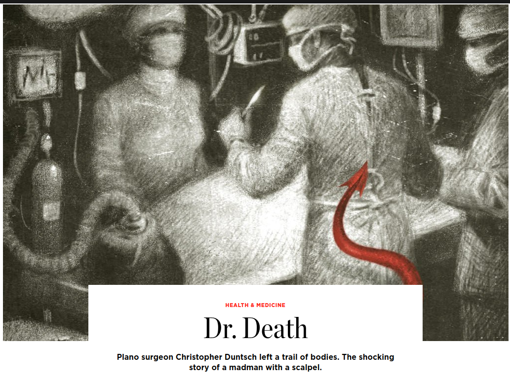
]


---
class: clear

.center[
  
]

---
# Baylor Plano, 2011, Lee Passmore

.center[
  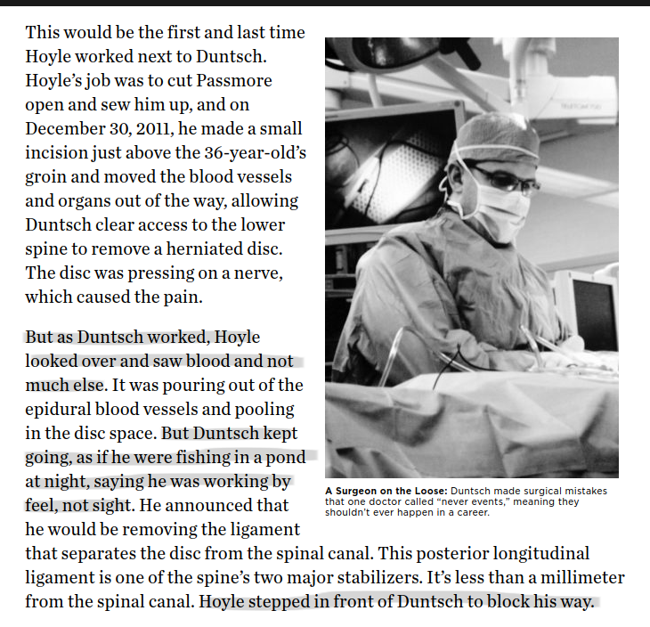
]

---
count: false

# Baylor Plano, 2012, Barry Morguloff

.center[
  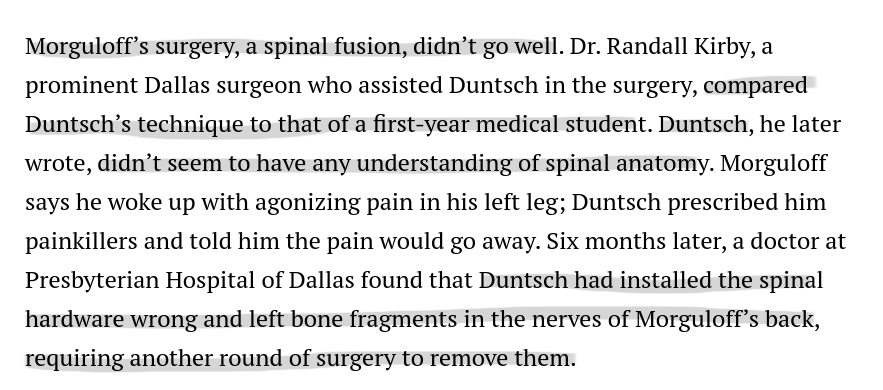
]


---
count: false

# Baylor Plano, 2012, Jerry Summers

.center[
  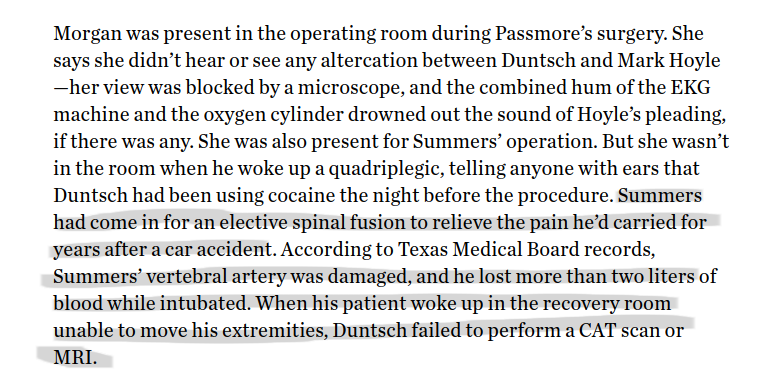
]


---
count: false

# Baylor Plano, 2012, Kellie Martin

.center[
  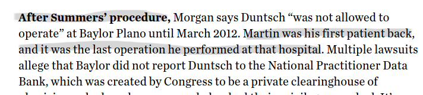
  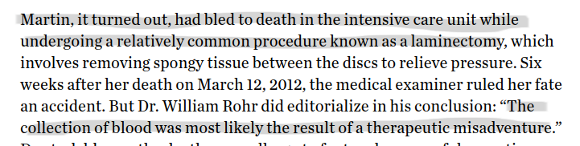
]


---
count: false

# Dallas Medical Center, 2012, Floella Brown

.center[
  
]


---
count: false

# Dallas Medical Center, 2012, Mary Efurd

.center[
  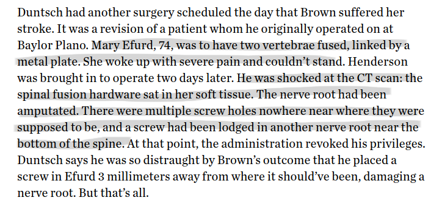
]


---
count: false

# South Hampton Medical, 2012, Jeff Cheney

.center[
  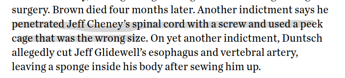
]


---
count: false

# Legacy Surgery Center at Frisco, 2012, Marshall Muse

.center[
  
]

---
count: false

# Legacy Surgery Center at Frisco, 2012, Jacqueline Troy

.center[
  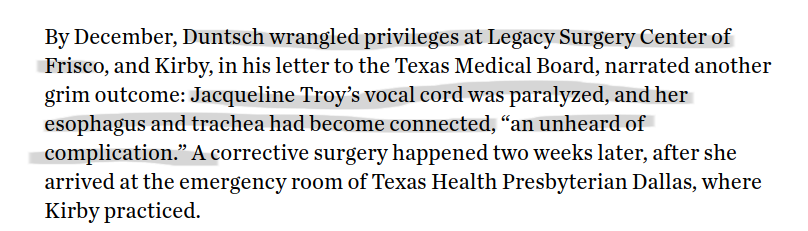
]


---
count: false

# Legacy Surgery Center at Frisco, 2013, Philip Mayfield

.center[
  
]


---
count: false

# University General at Dallas, 2013, Jeff Glidewell

.center[
  
]

---
# Question

- **Motivating question:** How did Dr. Death keep getting patients?
- **Research question:** Do PCPs learn about specialist quality and adjust referral patterns accordingly?

---
# Contribution

1. Health care policy:
  - Significant focus on changing physician treatment decisions
  - We consider changing who does the procedure rather than how it's done
--

2. Referrals and learning:
  - Consider and estimate physician learning directly
  - Much more complete data

---
count: false

# Contribution

- Almost no work on physician learning in referrals
- **Johnson (2011) "Ability, Learning, and the Career Path of Cardiac Specialists."**
--

  - Frequency of exits or practice movements as function of negative outcomes
  - Low quality surgeons more likely to exit market or move practice
  - Data for specialists only, assumed to reflect learning after ruling out other mechanisms


---
count: false

# Contribution

- Almost no work on physician learning in referrals
- Johnson (2011) "Ability, Learning, and the Career Path of Cardiac Specialists."
- **Sarsons (2017), "Interpreting Signals in the Labor Market: Evidence from Medical Referrals"**
--

  - Considers learning framework as motivation
  - Estimates relationship between negative outcomes and quarterly referrals among PCP/specialist pairs
  - PCPs interpret negative outcomes differentially by gender


---
class: inverse, center, middle
name: model

# Referral Framework

<html><div style='float:left'></div><hr color='#EB811B' size=1px width=1055px></html>


---
# Setup

- PCP $i$ sends a patient to specialist $j$ at time $t$, $D_{ijt} \in 0,1$
- Outcome is binary $Y_{ijt} \in 0,1$, with 1 being success (e.g., no complication or readmission)
- Probability of success for specialist $j$: $p_j \equiv \Pr(Y_{ijt} = 1)$, assumed constant over time and across patients

--

PCPs do not know $p_j$ but use Bayesian inference to learn about it from their patients' outcomes


---
# Beliefs

- Beliefs about $p_j$ follow a beta distribution, with parameters:

  - $(a_0, b_0)$ in the initial period (common prior beliefs) 
  - $(a_{ijt}, b_{ijt})$ in period $t$
  
--

- Beliefs updated based on the numbers of successes and failures experienced with specialist $j$, as follows:
$$a_{ijt} = a_0 + \sum_{s=1}^t Y_{ijs}$$ 
$$b_{ijt} = b_0 + \sum_{s=1}^t (D_{ijs} - Y_{ijs})$$


---
count: false

# Beliefs

Mean and variance of the beliefs about $p_j$ in period $t$:
$$m_{ijt} \equiv \frac{ a_{ij,t-1} }{ a_{ij,t-1} + b_{ij,t-1} }$$
$$v_{ijt} \equiv \frac{ a_{ij,t-1} b_{ij,t-1} }{ (a_{ij,t-1} + b_{ij,t-1})^2 (a_{ij,t-1} + b_{ij,t-1} + 1) }$$


---
# PCP Objective

- PCPs perfect agents of patients
- Patient (and PCP) utility: $U_{ijt} = \alpha Y_{ijt} + \epsilon_{ijt}$

--

PCP chooses specialist with highest expected utility:

$$\max_j \text{E} \left[ U_{ijt} | a_{ij,t-1}, b_{ij,t-1} \right] = \max_j \left\{ \alpha \text{E} \left[ Y_{ijt} | a_{ij,t-1}, b_{ij,t-1} \right]+ \epsilon_{ijt} \right\}$$

---
class: inverse, center, middle
name: data

# Data and Restrictions

<html><div style='float:left'></div><hr color='#EB811B' size=1px width=1055px></html>


---
# Data Sources

- 100% Medicare claims data (Inpatient, Outpatient, Carrier Claims) from 2008 through 2018
- MD-PPAS (physician information)
- AHA Annual Surveys (hospital characteristics)
- American Community Survey (market level demographics)


---
# Sample Construction

- Planned and elective inpatient stays
- Age 65 or above
- Major joint surgery
  - DRG 470 (major joint replacement, lower, w/o cc): 87%
  - DRG 483 (major joint replacement, upper, with cc): 5%
  - DRG 469 (major joint replacement, lower, with cc): 3%
  - DRG 462 (multiple joint procedures, lower, w/o cc): 2%
  
---
# What is a referral?

- Assign a PCP to each surgery based on:

  - Referring physician listed "in the data"
  - Most frequently visited physician in last year
    - Tiebreaker to most recently visited
  - Limit to primary care specialty codes
  - Limit to established or will-be-established PCPs
  
--

- Specialist based on:
  - Operating physician listed on the claim
  - Limit to orthopedic surgeons


---
# What is a failure?

Any of the following:

- 90-day mortality
- 90-day readmission
- 90-day complication (SSI or sepsis)


---
# A note on information...

- PCP "sees" all failure events for their own patients
- Failures/successes only inform about quality of specialist $j$


---
class: inverse, center, middle
name: descriptive

# Description of Referrals and Referral Networks

<html><div style='float:left'></div><hr color='#EB811B' size=1px width=1055px></html>


---
# Size of Referral Networks

.center[
  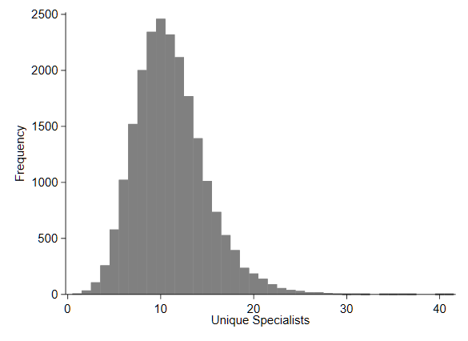
]

---
# Attachment to Specialists

.center[
  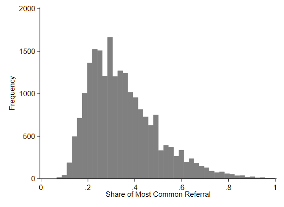
]


---
# Pairwise referrals over time

.center[
  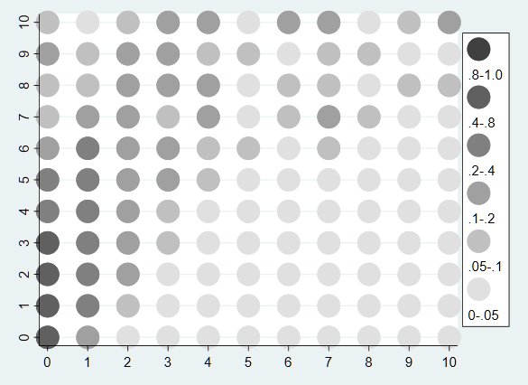
]


---
count: false

# Pairwise referrals over time

.center[
  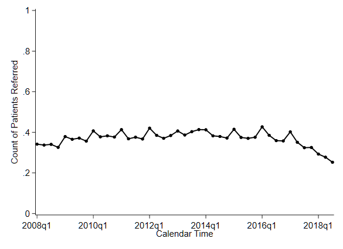
]

---
# Referrals and failures

.pull-left[
  
]

.pull-right[
  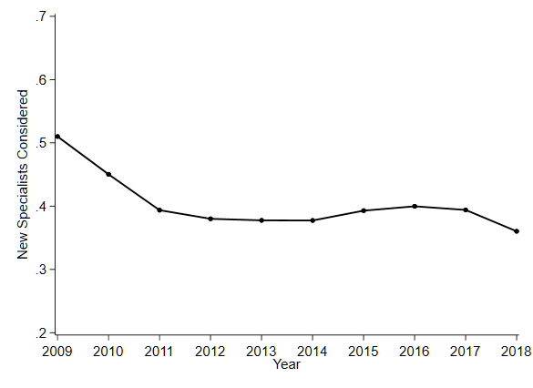
]

---
count: false

# Referrals and failures

| Outcome: New Specialists   |  (1)        |    (2)     |    (3)     |    (4)     |
|:-------------------|------------:|-----------:|-----------:|-----------:|
| Failures           |  0.235\***  | 0.263\***  | 0.007      |  0.172\*** |
|                    | (0.005)     | (0.005)    |(0.006)     |(0.009)     |
| Same Practice      |             |-0.170\***  | -0.360\*** | -0.366\*** |
|                    |             |(0.005)     |(0.009)     |(0.008)     |
| Patients           |             |            | 0.219\***  |  0.248\*** |
|                    |             |            | (0.007)    |(0.003)     |
| Failures x Patients|             |            |            | -0.031\*** |
| \*** p-value <0.01   |             |            |            | (0.001)    |


---
class: inverse, center, middle
name: learning

# Preliminary Learning Results

<html><div style='float:left'></div><hr color='#EB811B' size=1px width=1055px></html>


---
# Myopic Referrals

PCP only cares about experience up to time $t-1$:

$$\begin{align}
\max_j \text{E} \left[ U_{ijt} | a_{ij,t-1}, b_{ij,t-1} \right] &= \max_j \left\{ \alpha \text{E} \left[ Y_{ijt} | a_{ij,t-1}, b_{ij,t-1} \right]+ \epsilon_{ijt} \right\} \\
 &=\max_j \left\{ \alpha m_{ijt} + \epsilon_{ijt} \right\}
 \end{align}$$

---
# Estimation

- Multinomial logit with panel
- Choice set is all specialists referred to at any point in data
- Failure rate based on cumulative failures and patients over prior 5 years
- Estimation limited to 20% sample, 2013 through 2018

---
# Results

| Variable           |     (1)     |  (2)       |   (3)      |      (4)   |
|:-------------------|------------:|-----------:|-----------:|-----------:|
| Pair Failure Rate  |  0.249\***  |-0.146\***  | -0.189\*** | -0.124\*** |
|                    |**[0.021]**  |**[-0.022]**|**[-0.029]**|**[-0.019]**|
| "Attachment"       |             |3.761\***   | 3.254\***  | 3.914\***  |
|                    |             |**[0.558]** |**[0.495]** |**[0.585]** |
| **Specification**  |             |            |            |            |
| Specialist Variables |           |            |    X       |            |
| Similar Patients   |             |            |            |     X      |
| Log Likelihood     | -193,422    |  -177,032  | -171,737   | -87,011    |
| \*** p-value <0.01 |             |            |            |            |


---
count: false

# Results

Interpreting a marginal effect of -0.02:

- 0.1 pp increase in failure rate (double)
- 0.2 pp decrease in referral probability (about 2%)

---
# Forward-looking PCP

- PCP incorporates value of experimenting with unknown specialists
- Reduces to optimal stopping rule (when to try someone new)
- Dynamic problem simplifies with *Gittins Index*, $g(m_{ijt}, v_{ijt})$

--

$$\max_j \text{E} \left[ V_{ijt} | a_{ij,t-1}, b_{ij,t-1} \right]
= \max_j \left\{ g(m_{ijt}, v_{ijt}) + \epsilon_{ijt} \right\}$$


---
count: false

# Forward-looking PCP

From Brezzi and Lai (2002) JEDC, close approximation to Gittins Index in our case is:

$$\begin{align}
&\max_j \text{E} \left[ V_{ijt} | a_{ij,t-1}, b_{ij,t-1} \right]
 = \max_j \left\{ g(m_{ijt}, v_{ijt}) + \epsilon_{ijt} \right\} \\
 &= \max_j \left\{m_{ij} + \sqrt{v_{ij}} \cdot \psi \left(-\frac{1}{\ln(\beta)(n_{ij}+1)} \right) + \epsilon_{ijt} \right\}\end{align}$$

---
# Results

```{r mfx, include=FALSE}
mfx <- tribble(
  ~term, ~estimate, ~conf.low , ~conf.high, ~ll, 
 0.5, 0.787, 0.739, 0.835, '-192,134',
 0.6, 0.818, 0.761, 0.875, '-192,395',
 0.7, 0.758, 0.692, 0.823, '-192,745',
 0.8, 0.531, 0.464, 0.597, '-193,118',
 0.9, 0.195, 0.137, 0.254, '-193,355',
 1, -0.039, -0.092, 0.014, '-193,393'
)

dwplot(mfx,whisker_args=list(color="black", size=1.1),
                  dot_args = list(color="black"),
                  vars_order = c("1","0.9","0.8","0.7","0.6","0.5")) +
    coord_flip() + theme_bw() + theme(legend.position="none") +
    labs(y = "Prior Success Rate",
       x = "Coefficient and 95% CI") +
  geom_text(aes(label=ll,x=conf.low, y=term), vjust=1) +
  annotate("text",y=2, x=0, label='Myopic LL: -193,422')
```


```{r mfx-plot, ref.label="mfx", fig.callout=TRUE, warning=FALSE}
```

---
# Takeaways

1. Very preliminary! 
2. But early evidence suggesting some amount of forward-looking behavior
3. Sensitive to priors and weight on priors

---
# Next steps

- Exploit exogenous changes to specialist choice sets
- Incorporate attachment and distance into dynamic setup
- Counterfactuals:
  - Removal of attachment/familiarity
  - Transparent specialist quality


```{r echo=FALSE, include=FALSE, eval=FALSE}
pagedown::chrome_print("unc-202111.html", 
                       output = "unc-202111.pdf")
```  