class: clear

<!-- Adjust some CSS code for font size, maintain R code font size -->
<style type="text/css">
.remark-slide-content {
    font-size: 30px;
    padding: 1em 2em 1em 2em;    
}
.remark-code, .remark-inline-code { 
    font-size: 20px;
}
</style>


<!-- Set R options for how code chunks are displayed and load packages -->
```{r setup, include=FALSE}
options(htmltools.dir.version = FALSE)
options(dplyr.summarise.inform = FALSE)
library(knitr)
opts_chunk$set(
  fig.align="center",  
  fig.height=3, #fig.width=6,
  # out.width="748px", #out.length="520.75px",
  dpi=300, #fig.path='Figs/',
  cache=T#, echo=F, warning=F, message=F
  )

knitr::opts_hooks$set(fig.callout = function(options) {
  if(options$fig.callout) {
    options$echo = FALSE
  }
  options
})

if (!require("pacman")) install.packages("pacman")
pacman::p_load(tidyverse, ggplot2, dplyr, lubridate, readr, readxl, hrbrthemes,scales, gganimate, gapminder, gifski, png, tufte, plotly, OECD, ggrepel, xaringanExtra, webshot, widgetframe)
```


```{r xaringan-scribble, echo=FALSE}
xaringanExtra::use_scribble(rgb(0.9, 0.5, 0.5))
```


.center[
  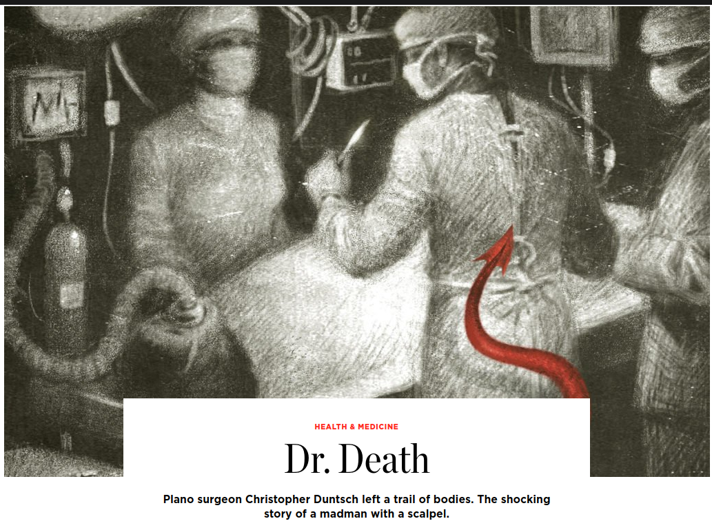
]


---
class: clear

.center[
  
]

---
# Baylor Plano, 2011, Lee Passmore

.center[
  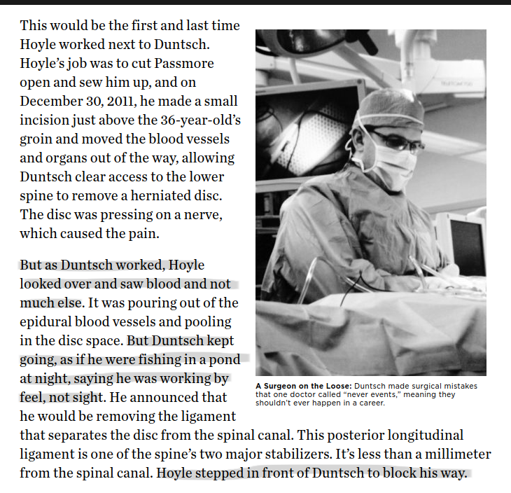
]

---
count: false

# Baylor Plano, 2012, Barry Morguloff

.center[
  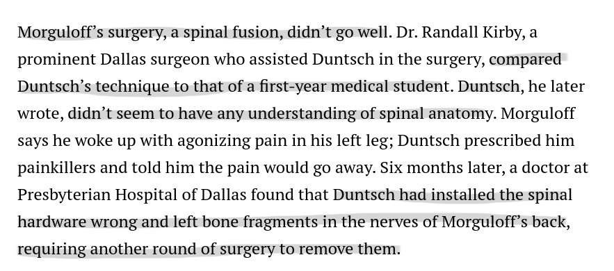
]


---
count: false

# Baylor Plano, 2012, Jerry Summers

.center[
  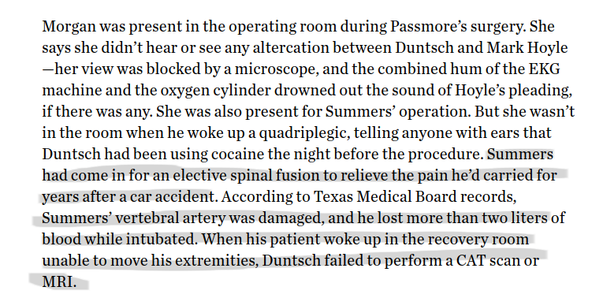
]


---
count: false

# Baylor Plano, 2012, Kellie Martin

.center[
  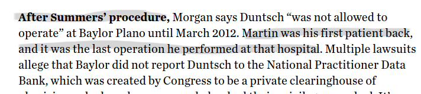
  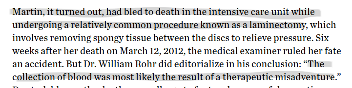
]


---
count: false

# Dallas Medical Center, 2012, Floella Brown

.center[
  
]


---
count: false

# Dallas Medical Center, 2012, Mary Efurd

.center[
  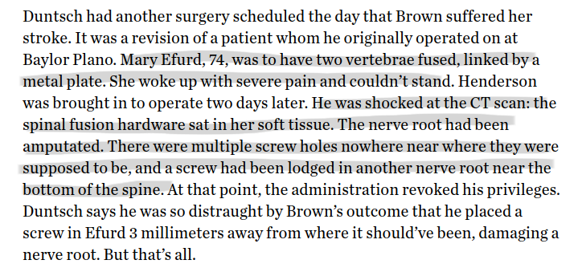
]


---
count: false

# South Hampton Medical, 2012, Jeff Cheney

.center[
  
]


---
count: false

# Legacy Surgery Center at Frisco, 2012, Marshall Muse

.center[
  
]

---
count: false

# Legacy Surgery Center at Frisco, 2012, Jacqueline Troy

.center[
  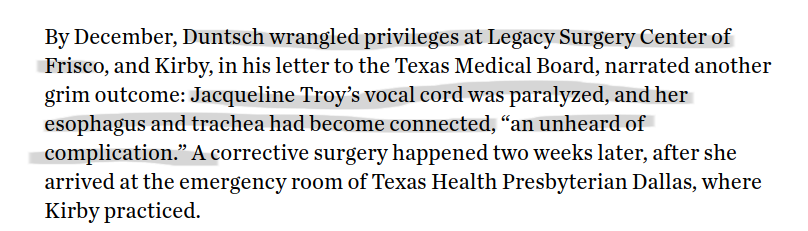
]


---
count: false

# Legacy Surgery Center at Frisco, 2013, Philip Mayfield

.center[
  
]


---
count: false

# University General at Dallas, 2013, Jeff Glidewell

.center[
  
]

---
# Question

- **Motivating question:** How did Dr. Death keep getting patients?
- **Research question:** Do PCPs learn about specialist quality and adjust referral patterns accordingly?

---
class: inverse, center, middle
name: model

# Learning Framework

<html><div style='float:left'></div><hr color='#EB811B' size=1px width=1055px></html>


---
# Setup

- PCP $i$ sends a patient to specialist $j$ at time $t$, $D_{ijt} \in 0,1$
- Outcome is binary $Y_{ijt} \in 0,1$, with 1 being success (e.g., no complication or readmission)
- Probability of success for specialist $j$: $p_j \equiv \Pr(Y_{ijt} = 1)$, assumed constant over time and across patients

--

PCPs do not know $p_j$ but use Bayesian inference to learn about it from their patients' outcomes


---
# Beliefs

- Beliefs about $p_j$ follow a beta distribution, with parameters:

  - $(a_0, b_0)$ in the initial period (common prior beliefs) 
  - $(a_{ijt}, b_{ijt})$ in period $t$
  
--

- Beliefs updated based on the numbers of successes and failures experienced with specialist $j$, as follows:
$$a_{ijt} = a_0 + \sum_{s=1}^t Y_{ijs}$$ 
$$b_{ijt} = b_0 + \sum_{s=1}^t (D_{ijs} - Y_{ijs})$$


---
count: false

# Beliefs

Mean and variance of the beliefs about $p_j$ in period $t$:
$$m_{ijt} \equiv \frac{ a_{ij,t-1} }{ a_{ij,t-1} + b_{ij,t-1} }$$
$$v_{ijt} \equiv \frac{ a_{ij,t-1} b_{ij,t-1} }{ (a_{ij,t-1} + b_{ij,t-1})^2 (a_{ij,t-1} + b_{ij,t-1} + 1) }$$


---
# Patient Utility

- PCPs perfect agents of patients
- Patient (and PCP) utility: $U_{ijt} = \alpha Y_{ijt} + \epsilon_{ijt}$
- PCP chooses specialist with highest expected utility


---
class: inverse, center, middle
name: data

# Data and Restrictions

<html><div style='float:left'></div><hr color='#EB811B' size=1px width=1055px></html>


---
# Data Sources

- 100% Medicare claims data (Inpatient, Outpatient, Carrier Claims) from 2008 through 2018
- MD-PPAS (physician information)
- AHA Annual Surveys (hospital characteristics)
- American Community Survey (market level demographics)


---
# Sample Construction

- Planned and elective inpatient stays
- Age 65 or above
- Major joint surgery
  - DRG 470 (major joint replacement, lower, w/o cc): 86%
  - DRG 483 (major joint replacement, upper, with cc): 6%
  - DRG 469 (major joint replacement, lower, with cc): 3%
  - DRG 462 (multiple joint procedures, lower, w/o cc): 2%

  
---
# What is a referral?

- Assign a PCP to each surgery based on:

1. Referring physician listed "in the data"
2. Most frequently visited physician in last year
  - Tiebreaker to most recently visited
  
--

- Specialist is operating physician listed on the claim

---
# What is the referring "physician"?

- Lots of very small numbers for each PCP/specialist pair
- Aggregate PCP to practice level
- Practice defined by primary tax ID and zip code
- Limit to established practices
  - At least 3 consecutive years having non-zero referrals
  - At least 20 patients total across all years


---
# What is a failure?

Any of the following:

- 90-day mortality
- 90-day readmission
- 90-day complication (SSI or sepsis)


---
# A note on information...

For now:

- Information flows to the practice rather than a single PCP
- Practice "sees" all failure events for their own patients


---
class: inverse, center, middle
name: descriptive

# Description of Referrals and Referral Networks

<html><div style='float:left'></div><hr color='#EB811B' size=1px width=1055px></html>


---
# Size of Referral Networks

.pull-left[
  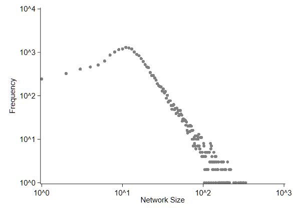
]

.pull-right[
  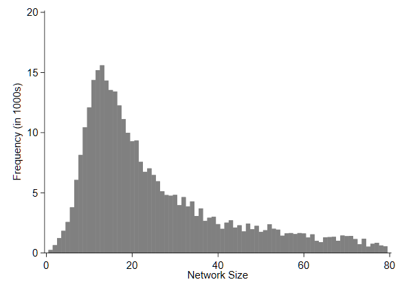
]

---
# Attachment to Specialists

.center[
  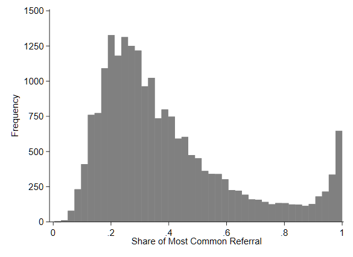
]


---
# Pairwise referrals over time

.center[
  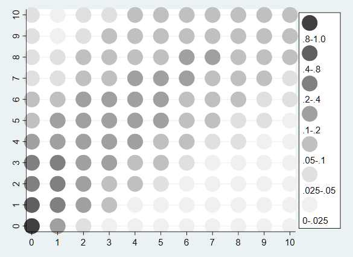
]


---
count: false

# Pairwise referrals over time

.center[
  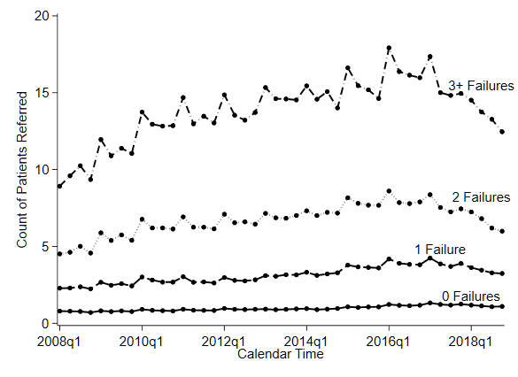
]


---
# Referrals and failure events

.center[
  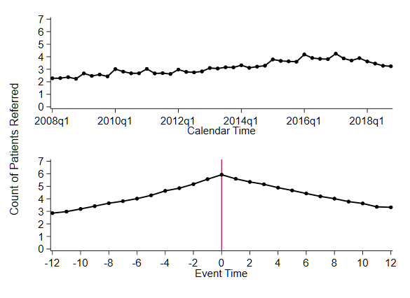
]


---
class: inverse, center, middle
name: learning

# Preliminary Learning Results

<html><div style='float:left'></div><hr color='#EB811B' size=1px width=1055px></html>


---
# Myopic Referrals

PCP only cares about experience up to time $t-1$:

$$
\begin{align}
\max_j \text{E} \left[ U_{ijt} | a_{ij,t-1}, b_{ij,t-1} \right] &= \max_j \left\{ \alpha \text{E} \left[ Y_{ijt} | a_{ij,t-1}, b_{ij,t-1} \right]+ \epsilon_{ijt} \right\} \\
 &=\max_j \left\{ \alpha m_{ijt} + \epsilon_{ijt} \right\}
\end{align}
$$

---
# Estimation

- Standard multinomial logit
- Choice set is all specialists referred to at any point in the past year
- Failure rate based on cumulative failures and patients over prior 5 years
- Outside option: average specialist in same market
- Limited to 2013 through 2018

---
# Results

| Variable           |   (1)       |   (2)      |      (3)   |   (4)      |
|:-------------------|------------:|-----------:|-----------:|-----------:|
| Pair Failure Rate  | -0.051      | -0.460     | -0.446     | -0.554     |
|                    |**[-0.004]** |**[-0.065]**|**[-0.063]**|**[-0.088]**|
| "Attachment"       |             |            | -0.714     | -0.751     |
|                    |             |            |**[-0.101]**|**[-0.120]**|
| **Specification**  |             |            |            |            |
| "Attachment"       |             |    X       |   X        |    X       |
| Specialist Vars    |             |            |            |    X       |


All coefficients significant at $p<0.01$

---
count: false

# Results

| Variable           |   (1)       |   (2)      |
|:-------------------|------------:|-----------:|
| Pair Failure Rate  | -0.446      | -0.467     |
|                    |**[-0.063]** |**[-0.400]**|
| Other Failure Rate | -0.714      | -0.295     |
|                    |**[-0.101]** |**[-0.047]**|
| **Sample**         |             |            |
| Observed Failures  |    X        |            |
| Healthy Patients   |             |    X       |


All coefficients significant at $p<0.01$

---
# Forward-looking PCP

- PCP incorporates value of experimenting with unknown specialists
- Value to learning about other specialists in the market
- Dynamic problem simplifies with *Gittins Index*, $g(m_{ijt}, v_{ijt})$

--

$$\max_j \text{E} \left[ V_{ijt} | a_{ij,t-1}, b_{ij,t-1} \right]
= \max_j \left\{ \alpha m_{ijt} + g(m_{ijt}, v_{ijt}) + \epsilon_{ijt} \right\}$$


---
# 